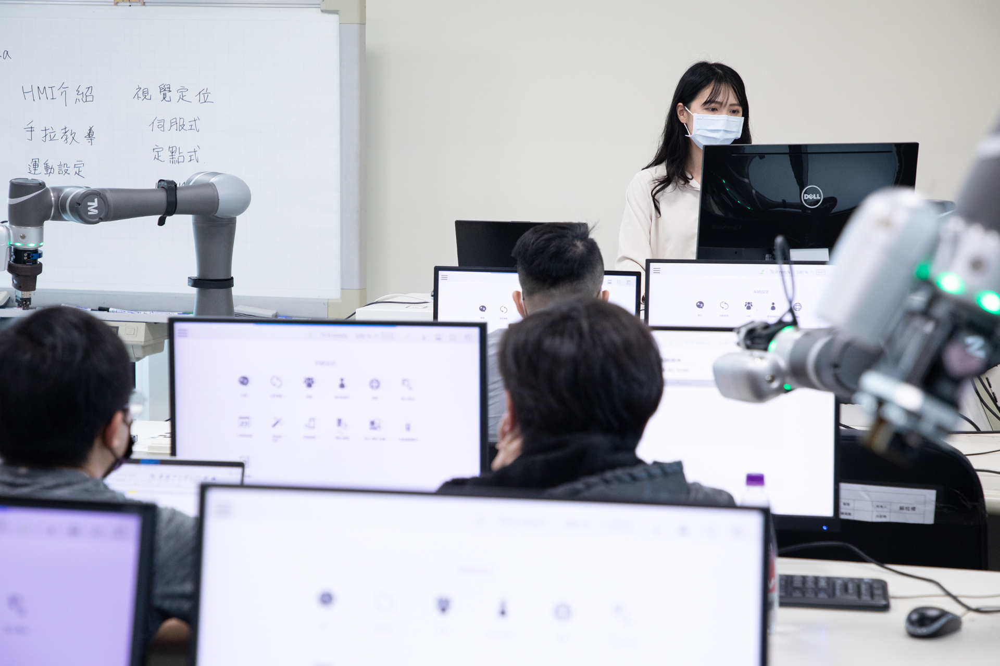

# __TM ROBOT__
aaa</br>
bbb


| table1|table2|table3|
|:---|:---|:---|
| a|b|c|
| a|b|c|
| a|b|c|

[this link](https://techman-robot-ros.readthedocs.io/en/latest/ROS2Demonstration.html#usage-with-demo-code-driver)</br></br>
</br>
</br>
__single ROS node__</br>
single ROS node</br>

aaa bb ``python run.py`` ccc
```
python runit.py
python hi.py
```